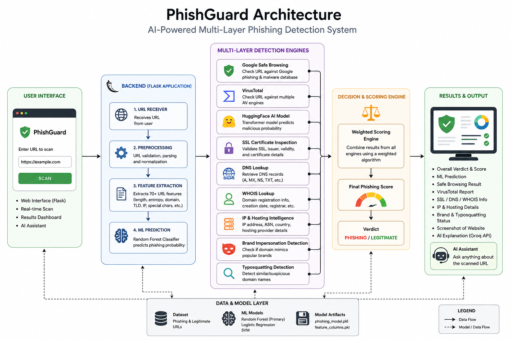

# 🛡️ PhishGuard — AI-Powered Phishing URL Detection System

An intelligent phishing URL detection platform that combines Machine Learning, Threat Intelligence APIs, URL feature engineering, SSL/DNS inspection, WHOIS analysis, and AI-powered explanations to identify malicious websites with high confidence.

---

## 🚀 Features

- 🤖 Machine Learning phishing detection
- 🌲 Random Forest, Logistic Regression & Support Vector Machine
- 🛡️ Google Safe Browsing integration
- 🦠 VirusTotal threat intelligence
- 🧠 HuggingFace AI malware detection
- 🔍 URL feature extraction
- 🌐 DNS Lookup
- 🔒 SSL Certificate validation
- 📍 IP & Hosting information
- 📄 WHOIS Lookup
- 🎭 Brand impersonation detection
- ⚠️ Typosquatting detection
- 💬 AI assistant powered by Groq
- 📸 Live website screenshots
- 📊 Confidence-based final verdict

---

# System Overview

Unlike traditional phishing detectors that rely solely on machine learning, PhishGuard combines multiple detection engines into a single intelligent scoring system.

Each URL is analyzed using:

- Machine Learning
- Google Safe Browsing
- VirusTotal
- HuggingFace AI
- SSL inspection
- DNS analysis
- WHOIS lookup
- IP intelligence
- Brand impersonation detection
- URL heuristics

The results are merged into a weighted scoring engine to generate the final phishing prediction.

---

# Machine Learning Pipeline

```text
Dataset
   │
   ▼
Data Cleaning
   │
   ▼
Balanced Sampling
   │
   ▼
Feature Engineering
   │
   ▼
Train/Test Split
   │
   ▼
Model Training
   ├── Logistic Regression
   ├── Random Forest
   └── Support Vector Machine
   │
   ▼
Evaluation
   │
   ▼
Save Best Model
```

---

# Detection Workflow

```text
User URL
   │
   ▼
Feature Extraction
   │
   ▼
Machine Learning Prediction
   │
   ▼
Google Safe Browsing
   │
   ▼
VirusTotal
   │
   ▼
HuggingFace AI
   │
   ▼
SSL Inspection
   │
   ▼
DNS Lookup
   │
   ▼
WHOIS Analysis
   │
   ▼
Brand Detection
   │
   ▼
Typosquatting Detection
   │
   ▼
Weighted Scoring Engine
   │
   ▼
Final Verdict
```

---

# Features Extracted

The model extracts more than **70 handcrafted URL features**, including:

- URL Length
- Domain Length
- Path Length
- Query Length
- URL Depth
- Number of Digits
- Number of Dots
- Number of Special Characters
- Entropy
- HTTPS Usage
- IP Address Detection
- Suspicious TLD Detection
- Encoded Characters
- Multiple HTTP Detection
- Uppercase/Lowercase Ratio

and many more.

---

# Technologies Used

## Backend

- Flask
- Python

## Machine Learning

- Scikit-Learn
- Random Forest
- Logistic Regression
- Support Vector Machine

## AI

- HuggingFace Transformers
- Groq API

## Threat Intelligence

- Google Safe Browsing API
- VirusTotal API
- APIFlash Screenshot API

## Network Analysis

- WHOIS
- DNS Resolver
- SSL
- IPWhois

## Data Processing

- Pandas
- NumPy

---

# Dataset

The phishing detection model is trained on a balanced dataset containing **70,000 URLs**.

| Class | Samples |
|--------|---------|
| Legitimate | 35,000 |
| Phishing | 35,000 |

The preprocessing pipeline includes:

- Label normalization
- Duplicate removal
- Missing value handling
- Balanced sampling
- Numeric feature selection

---

# Models Trained

| Model | Purpose |
|--------|----------|
| Logistic Regression | Baseline model |
| Random Forest | Final production model |
| Support Vector Machine | Performance comparison |

The Random Forest classifier is selected as the final model and exported using Pickle.

---

# Project Structure

```text
PhishGuard/

│── app.py
│── phishing_model.pkl
│── feature_columns.pkl
│── requirements.txt
│── .env
│── README.md
│
├── templates/
│     ├── index.html
│     └── result.html
│
├── static/
│
├── screenshots/
│     ├── homepage.png
│     ├── scan_result.png
│     ├── architecture.png
│     └── workflow.png
│
└── dataset/
```

---

# Installation

Clone the repository

```bash
git clone https://github.com/yourusername/PhishGuard.git
```

Move into the project

```bash
cd PhishGuard
```

Install dependencies

```bash
pip install -r requirements.txt
```

Create a `.env` file

```text
GOOGLE_API_KEY=
VIRUSTOTAL_API_KEY=
APIFLASH_KEY=
GROQ_API_KEY=
```

Run the application

```bash
python app.py
```

---

# Screenshots

## Homepage


---

## ✅ Legitimate Website Detection


---

## 🚨 Phishing Website Detection


---

## AI Assistant


---

## System Architecture



---

# Future Improvements

- Browser Extension
- REST API
- Email Phishing Detection
- QR Code Detection
- Deep Learning Models
- User Authentication
- Scan History
- Docker Support
- Cloud Deployment

---

# License

This project is intended for educational and research purposes.

---

# Author

**Ayesha Sajid**

Cybersecurity | Machine Learning | Artificial Intelligence